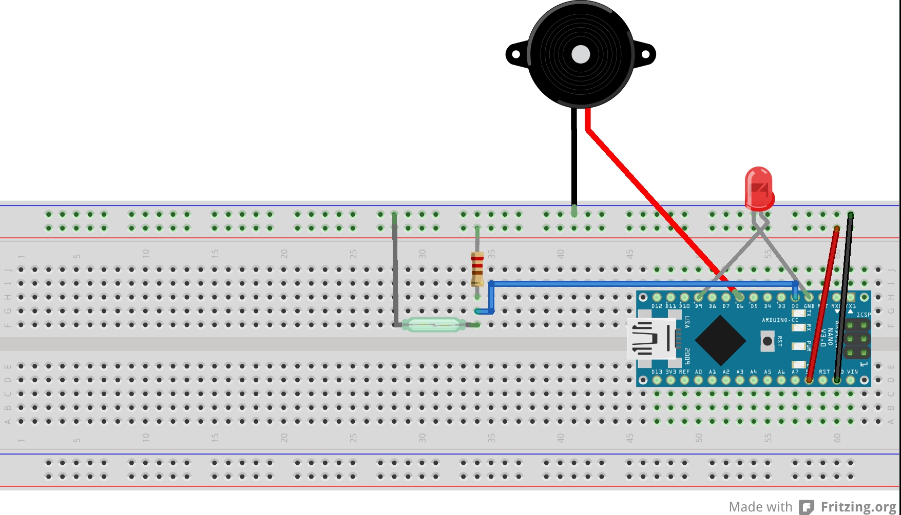

# Semaforo y Alarma con reedswitch y sensor PIR Arduino

Introducción
============
La siguiente práctica es la unión entre un semáforo peatonal y vehicular con 2 tipos de alarma: magnético y movimiento.

**Semáforo vehicular y peatonal:** El proyecto consiste en un cruce de semáforos, uno de vehículos y otro de peatones. El semáforo de vehículos está normalmente verde (y el de peatones rojo), hasta que algún peatón pulsa el pulsador. Entonces, el amarillo de los vehículos parpadea durante un tiempo prudencial y pasa a rojo. En ese momento el semáforo de peatones pasa a verde y se emite un sonido para indicar el cruce. Tras unos segundos el verde de los peatones pasa a rojo terminando el sonido emitido para cruce. En ese momento el de los vehículos pasa a verde.
**Alarma con reedswitch y PIR:** Se pueden encontrar en los sensores de las puertas y ventanas de las alarmas antirrobo, el imán va unido a la puerta y el reed switch al marco. Vamos a implementar con Arduino una Alarma. Cuando el Reed Switch está en nivel alto debido a la presencia del imán la alarma está desactivada, pero al quitar el imán la alarma se activa haciendo sonar un Buzzer Piezo eléctrico y parpadear un Led. 
**El sensor de movimiento** es un dispositivo electrónico que actúa cuando detecta movimiento en el área vigilada. Sus utilidades son diversas, en algunos casos se utiliza para seguridad y otras como automatización. Dentro de los sensores infrarrojos hay variedades según la utilidad o conveniencia del usuario. Algunos casos se usa para seguridad, por lo tanto estos detectores varían principalmente en la tensión de trabajo.

Objetivo
========
Realización de programa y circuito de un semáforo vehicular y peatonal poder de cambio al pulsar un botón. Alarma en la cual, al detectar un campo magnético o detecte un movimiento de entrada suene la alarma de aviso y encienda el led correspondiente.

Material
========
*GENERAL:*
-	Arduino UNO
-	9 resistencias 270 Ω o 330 Ω
  - Semáforo
     - 2 Led rojo
     - 2 led verde
     - 1 led amarillo
     - 1 boton
     - 1 zumbador (buzzer)
  - Alarma
     - Reedswitch
     - Sensor PIR
     - 2 Leds  dediferente color
     - zumbador (buzzer)

